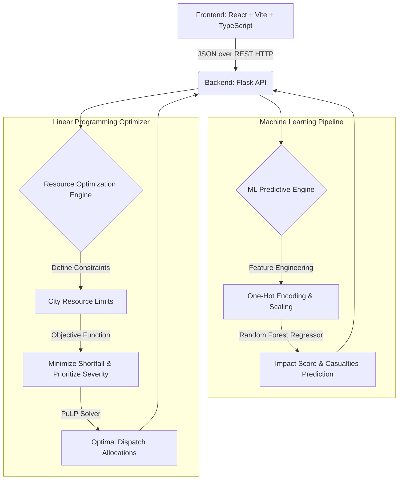

# RESQAI: Comprehensive System Architecture & Application Summary

**RESQAI** is a state-of-the-art, AI-powered Emergency Response & Resource Optimization System. It serves as an intelligent, automated command center designed to revolutionize how emergency dispatchers predict crisis impacts and allocate scarce urban resources (ambulances, fire engines, rescue teams, and hospital beds). 

This document provides an exhaustive technical deep-dive into the application’s architecture, machine learning models, mathematical optimization engine, and frontend engineering.

---

## 1. System Architecture Overview

RESQAI follows a modern, decoupled client-server architecture:
- **Frontend Presentation Layer**: A React 18 single-page application (SPA) built with Vite and TypeScript.
- **Backend Application Layer**: A Python Flask REST API that orchestrates the data flow between the client and the underlying engines.
- **Intelligence Layer (ML)**: A Scikit-Learn based Machine Learning pipeline featuring a Random Forest Regressor for impact prediction.
- **Optimization Layer (OR)**: An Operations Research engine utilizing the `PuLP` linear programming library to mathematically optimize resource distribution across multiple simultaneous emergencies.

---

## 2. The Machine Learning Engine (Predictive Analytics)

At the core of RESQAI is its ability to accurately predict the "Impact Score" (a normalized 0-100 metric of emergency severity) and the estimated casualties before first responders even arrive on the scene.

### 2.1 Training Data & Feature Engineering
Since real-time emergency data is highly sensitive, RESQAI utilizes a sophisticated synthetic data generation script (`train_model.py`) that uses `pandas` and `numpy` to generate realistic emergency datasets (1,000+ records).

**Features fed into the model:**
- **Categorical Variables**: `incident_type` (Fire, Building Collapse, Flood, Road Accident, Chemical Leak), `weather` (Clear, Rain, Storm, Fog, Snow, Heatwave), `time_of_day`.
- **Numerical Variables**: `occupancy` (number of people in the vicinity), `response_eta` (minutes until arrival), `severity_indicator` (initial 1-10 gauge rating), `temperature`.

These features undergo **One-Hot Encoding** (for categoricals) and **Standard Scaling** before being passed to the model.

### 2.2 Model Architecture
The engine uses a **Random Forest Regressor** (`sklearn.ensemble.RandomForestRegressor`). 
- **Why Random Forest?** It inherently handles non-linear relationships and interactions between variables (e.g., a "Road Accident" during a "Storm" at "Night" scales exponentially in severity compared to a clear day). Furthermore, it provides excellent **Feature Importance** metrics, allowing the system to explain *why* it made a prediction.

### 2.3 Evaluation & Metrics
The model is rigorously evaluated using standard regression metrics, which are dynamically passed to the frontend via the `/model-info` endpoint:
- **$R^2$ Score (Coefficient of Determination)**: Measures how well the variance in the impact score is predicted by the features.
- **MAE (Mean Absolute Error)**: The average magnitude of errors in predictions.
- **RMSE (Root Mean Squared Error)**: Penalizes larger prediction errors heavily.

---

## 3. The Resource Optimization Engine (Operations Research)

When a city faces a single emergency, dispatching units is straightforward. When a city faces *multiple simultaneous emergencies* (e.g., a chemical leak and a highway pileup), dispatchers must decide how to divide a limited pool of resources. RESQAI automates this using Linear Programming.

### 3.1 Linear Programming Setup (`optimizer.py`)
The optimization engine is built using **PuLP**, a Python LP modeler. 

**Decision Variables:**
For each incident $i$, the engine must determine the integer number of:
- $A_i$: Ambulances dispatched
- $F_i$: Fire Engines dispatched
- $R_i$: Rescue Teams dispatched
- $H_i$: Hospital Beds allocated

**City Constraints:**
The total resources allocated across all $N$ active incidents cannot exceed the city's absolute limits:
- $\sum A_i \le Total Ambulances (e.g., 40)$
- $\sum F_i \le Total Fire Engines (e.g., 20)$
- $\sum R_i \le Total Rescue Teams (e.g., 15)$
- $\sum H_i \le Total Hospital Beds (e.g., 300)$

### 3.2 The Objective Function
The solver must optimize a complex objective function that minimizes the "penalty" of unfulfilled resource requirements while weighting the severity of each incident.

For every incident, the ML engine outputs a *Required* amount of resources (e.g., 5 Ambulances needed). 
The optimizer calculates the **Shortfall**: $(Required - Allocated)$.

The Objective Function mathematically minimizes the sum of all shortfalls, multiplied by the **Impact Score** of the incident. This mathematically guarantees that an incident with an Impact Score of 95 will receive priority over an incident with an Impact Score of 40 when resources are nearly depleted.

---

## 4. Backend API Design (Flask)

The Python Flask backend serves as the bridge, exposing a clean RESTful interface for the React client.

- **`POST /predict`**: Takes a single emergency payload (JSON). Returns the ML-predicted Impact Score, estimated injured/fatalities, confidence score, and a required resource array.
- **`POST /multi-predict`**: Accepts a batch of emergencies and returns independent predictions for all of them.
- **`POST /simulate`**: The flagship endpoint. It accepts an array of emergencies, passes them through the ML model to determine requirements, and then feeds those requirements into the PuLP Optimizer. It returns the globally optimized dispatch allocations across the entire city grid.
- **`GET /model-info`**: Extracts the live model metrics (MAE, RMSE, R²) and the Feature Importance array from `model_metrics.json` so the frontend can dynamically render the model's accuracy.

---

## 5. Frontend Engineering (React + Tailwind + Recharts)

The UI is engineered to simulate a high-tech, futuristic command center. It is built using **React 18** and **TypeScript** for strict type safety across the complex JSON data structures passed from the backend.

### 5.1 Design System & UI
- **Styling**: Tailwind CSS is used extensively for utility-first styling. The app utilizes a highly customized configuration (`tailwind.config.js`) featuring a deep dark-mode palette (`ink-900`, `ink-800`) accented by vibrant, high-contrast colors (`accent: #00ffcc`, `signal-red`, `signal-amber`).
- **Glassmorphism & Micro-animations**: Components feature subtle border-glows, pulse animations for active timelines, and smooth fade-ins (`animate-fade-in`) to feel "alive" and highly responsive.
- **Data Visualization**: **Recharts** is used for dynamic SVG-based charting. 

### 5.2 Key Components
- **`SimulatorPage`**: A complex form utilizing controlled React state to build emergency scenarios. It handles both "Single Incident" mode and the "Multi-Incident Optimization" batch generation.
- **`DashboardPage`**: A highly dynamic view that switches context based on the simulation mode:
  - *Single Mode*: Shows timeline progression, specific AI recommendations, and isolated impact breakdowns.
  - *Multi Mode*: Renders the `OptimizationPanel` (showing the objective solver value), the `ModelMetricsCard`, the `FeatureImportanceChart`, and the `IncidentComparisonGrid` (a card-based grid ranking active emergencies by severity).
- **`SimulationApi.ts`**: An abstracted network layer using the native `fetch` API, wrapped in Promise-based functions to ensure clean asynchronous state management in the React components.

---

## 6. Conclusion

RESQAI is not just a dashboard; it is a full-stack, AI-driven operations research pipeline. By seamlessly chaining Machine Learning predictions directly into a mathematical Linear Programming solver, it eliminates human error and drastically reduces latency in high-stakes environments. It is robust, mathematically sound, and wrapped in a cutting-edge civic tech interface.
