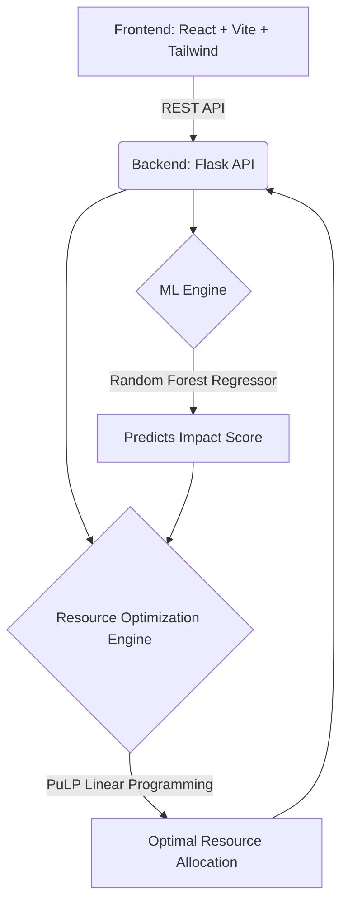

# RESQAI Project Brief

## Project Title
**RESQAI**: AI-Powered Emergency Response & Resource Optimization System

## Team
**The Optimizers 2026**
Team Size: 2 Members

## Final Project Scope
RESQAI is an intelligent emergency response system that leverages Machine Learning and Mathematical Optimization to predict the impact of emergency incidents and optimally allocate limited rescue resources (ambulances, fire engines, rescue teams). The system consists of a predictive ML engine, an optimization layer using PuLP, a Flask backend API, and a professional React-based command-center dashboard for simulations and monitoring.

## Architecture

## Feature List
1. **Emergency Simulation**: Generate synthetic emergency scenarios (Fire, Building Collapse, Flood, etc.).
2. **Impact Prediction**: Calculate an "Impact Score (0-100)" based on incident parameters (type, occupancy, weather, ETA, severity) using a Random Forest model.
3. **Resource Estimation**: Convert the predicted impact score into actionable requirements (e.g., number of ambulances, fire engines, etc. needed).
4. **Resource Optimization**: Optimally allocate resources across multiple concurrent incidents based on availability, capacity, and response times.
5. **Command-Center Dashboard**: Real-time visual interface with severity gauges, impact cards, charts, and timeline tracking.

## Team Responsibilities
- **Member 1 (Frontend/Integration)**: UI/UX, React Dashboard, API Integration, Presentation.
- **Member 2 (Backend/Data/ML)**: Data generation, ML Model Training, PuLP Optimization, Flask API Development.

## GitHub Repository
*(To be created/linked by the team)*
